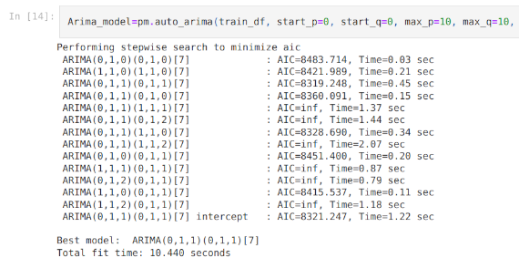
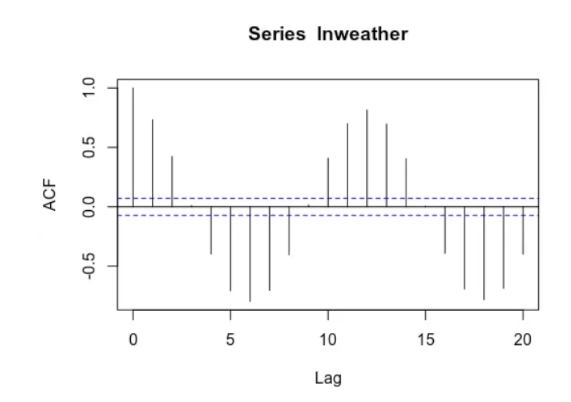

[Home](https://mgcodesandstats.github.io/) |
[Portfolio](https://mgcodesandstats.github.io/articles) |
[GitHub](https://github.com/mgcodesandstats) |
[LinkedIn](https://www.linkedin.com/in/michaeljgrogan/) |
[Stack Overflow](https://stats.stackexchange.com/users/137066/michael-grogan) |
[Terms](https://mgcodesandstats.github.io/terms/) |
[E-mail](mailto:contact@michael-grogan.com)

# Energy and Weather Modelling: Time Series Analysis

This project the use of time series models in forecasting electricity, temperature and rainfall patterns.

Data is sourced from [Met Éireann](https://www.met.ie/climate/available-data/historical-data), the [UK Met Office](https://www.metoffice.gov.uk/pub/data/weather/uk/climate/stationdata/braemardata.txt), and [data.gov.ie](https://data.gov.ie/dataset/energy-consumption-gas-and-electricity-civic-offices-2009-2012/resource/6091c604-8c94-4b44-ac52-c1694e83d746).

Techniques used include:

- ARIMA and Prophet for temperature forecasting
- LSTM for rainfall forecasting
- Monte Carlo simulations for extreme weather modeling
- PyFlux for probability-based analysis of temperature forecasts

## Articles

### [ARIMA vs LSTM: Forecasting Electricity Consumption](https://www.michael-grogan.com/articles/arima-lstm-electricity)

In this example, the ARIMA and LSTM models are used to predict electricity consumption patterns for the Dublin City Council Civic Offices, Ireland. Specifically, the data is provided in terms of kilowatt consumption every 15 minutes. Data is manipulated into a daily time series format using pandas and numpy, and forecasting performance across ARIMA and LSTM models are compared.

### [SARIMA vs Prophet: Forecasting Seasonal Weather Data](https://www.michael-grogan.com/articles/sarima-prophet-weather)

ARIMA and Prophet are major time series tools used to forecast future values. When conducting time series analysis, it is frequently the case that a time series will have a seasonal fluctuation — or a shift in the time series that periodically occurs during certain times. Weather data is a classic example of this — with temperatures fluctuating significantly during the four seasons. 

